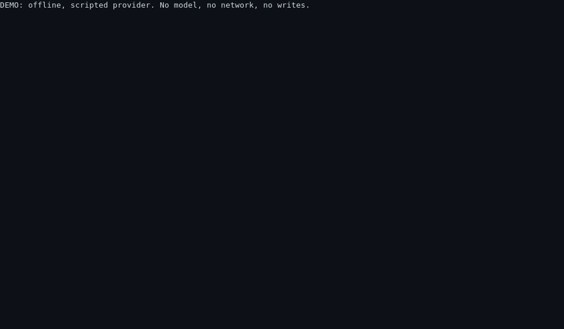

# budgetloop

> A tiny agent loop that treats **context as a budget, not a bucket**.

[](https://github.com/Aarf101/budgetloop/actions/workflows/check.yml)
[](#checks)
[](LICENSE)



<sub>Real `make demo` output, rendered frame by frame — [plain text here](docs/demo-output.txt).
Regenerate with `make demo-gif`.</sub>

`budgetloop` runs a coding agent's loop — perceive → plan → act → observe → iterate —
under four properties it cannot be argued out of:

1. it **cannot run forever** — `--max-steps` is a hard stop;
2. it **cannot silently overspend context** — the window has a budget and a ledger;
3. it **cannot touch anything it was not given** — tools are declared, sandboxed, gated;
4. it **leaves evidence** — every run writes a JSON trace that `inspect` reopens.

~1,900 lines, no dependencies, and the whole test suite runs offline for free.

## Quickstart

```bash
make demo     # offline, no API key: a scripted run that compacts and refuses a write
make check    # style + docstrings + skills + docs links + tests (the gate)
make score    # the Lab 2 before/after, from the committed scorecard
make run TASK='summarise the README'
```

Python 3.10+ and the standard library: no install step, no network, no API key.
A live model is opt-in twice over — a flag *and* a key — because "the agent
suddenly called a paid API" should never be an accident:

```bash
export ANTHROPIC_API_KEY=sk-ant-...
PYTHONPATH=src python3 -m budgetloop.cli run --provider anthropic --allow-network \
    --brief AGENTS.md --task "Explain the compaction policy"
```

## The loop, and the guards around it

```
[ system prompt ][ tool catalogue ][ task ] ──▶ provider.complete(messages, tools)
        ▲                                                     │
        │                                            tool calls?
 observations ◀── approval gate ◀── tool handler ─────────────┤
        │                                                     │
        └── budget check + compaction ◀──────────────────────┘     no ──▶ final answer
```

| Guardrail | When it triggers | Code |
| --- | --- | --- |
| Step cap | the run ends `step_limit`, with a message explaining the cap | `loop.py` |
| Token budget | the oldest tool exchange is summarised; if nothing is evictable, `budget_exceeded` | `context.py` |
| Workspace sandbox | escapes, absolute paths, symlinks and `.git/` raise `SandboxViolation` | `tools.py` |
| Approval gate | mutating tools need a policy; **no policy means refusal** | `tools.py` |
| Tool allow-list | only registered tools run, and `run_check` runs pre-registered argv only | `tools.py` |
| Output caps | oversized reads and observations are truncated with a visible notice | `tools.py` |
| Fail-closed network | the live provider needs `--allow-network` *and* a key | `cli.py` |
| Evidence | every run writes a trace; `inspect` reopens it later | `loop.py` |

## Context as a budget

`ContextWindow` is the part worth reading twice:

* **Everything is charged.** Each message reports its own token cost, framing
  overhead included, so the loop decides *before* it overflows.
* **Compaction is grouped, not line-by-line.** A tool request is welded to the
  observations it produced; evicting half an exchange would leave a transcript a
  real provider rejects, so eviction happens per exchange.
* **Some things are never evicted** — the system prompt, the current task, the
  newest exchanges — and if the protected set alone exceeds the budget, the run
  stops loudly rather than quietly forgetting the task.
* **Eviction is lossy and honest.** Dropped messages become one bounded excerpt
  summary (capped, so compaction can never *grow* the window), and the ledger
  records what was dropped and what it reclaimed.

A bucket just overflows. A budget tells you what you spent and what you gave up.

## Layout

```
.
├── AGENTS.md                     # the README for agents: setup, checks, guardrails
├── CLAUDE.md                     # Claude Code entry point: imports AGENTS.md
├── LICENSE                       # MIT
├── Makefile                      # demo / check / score / run / traces
├── REFLECTION.md                 # Lab 1: the 5-question rubric, answered
├── .github/workflows/check.yml   # the gate, on every push and pull request
├── docs/
│   ├── LAB2-BEFORE-AFTER.md      # Lab 2: protocol, findings, results
│   ├── SETUP-AGENTS.md           # driving Claude Code / Codex against a repo
│   ├── demo.gif                  # the demo above
│   ├── demo-output.txt           # its plain-text output
│   └── experiment-scorecard.csv  # Lab 2 raw data
├── scripts/
│   ├── check_docs.py             # Markdown links and paths must resolve
│   ├── check_style.py            # style + src/ and tests/ docstring gates
│   ├── example-run.json          # the scripted run behind `make run`
│   ├── render_demo_gif.sh        # regenerates docs/demo.gif
│   ├── run_experiment.py         # builds both Lab 2 arms from one commit
│   ├── score_experiment.py       # Lab 2 arithmetic
│   └── validate_skill.py         # the Agent Skills spec, as a check
├── skills/
│   ├── report-token-budget/      # reads a trace and reports where the budget went
│   └── write-agents-md/          # writes an AGENTS.md for any repository
├── src/budgetloop/               # messages, context, tools, providers, loop, cli
└── tests/
    └── fixtures/trace-demo-run.json   # a committed trace, so a fresh clone passes
```

`.claude/skills/<name>` symlinks point at `skills/<name>`, so Claude Code finds the
same files without a copy step.

## Reading order

1. `src/budgetloop/loop.py` — how a turn is assembled, and when it stops.
2. `src/budgetloop/context.py` — what the budget does when it fills.
3. `src/budgetloop/tools.py` — what the agent may touch, and who approves it.
4. `tests/test_loop.py` and `tests/test_context.py` — the guarantees as assertions.
5. `AGENTS.md` — how to work in this repository if you are an agent.

## My decisions

Four calls were mine, not the agent's:

* **Writes need my permission.** It has to ask before it modifies any file.
* **Safety before features.** Safety matters more than a new feature: the four
  guarantees — step cap, budget, sandbox, evidence — come first.
* **The tests run offline.** No network, no install step, half a second per run.
  That is what made running them after every change practical.
* **Nothing measured, nothing claimed.** The turn counts say `n/m` instead of a
  guess, so anyone who re-runs the experiment gets the same result on their machine,
  not just on mine.

## Limits

* Token counts are a **4-characters-per-token estimate**, not a tokenizer: compare
  runs to each other, never to a vendor's bill.
* Compaction summarises by **truncated excerpt**, not by asking a model to
  summarise. Cheap, deterministic, auditable — and lossy in a way a model-written
  summary would not be.
* The sandbox stops path escapes and accidents, **not** a hostile model: an approved
  write can still overwrite a file you wanted.
* The live provider is exercised against the payload builder and error paths, not
  against a paid account here. Model ids rotate; pass `--model` or set
  `BUDGETLOOP_MODEL`.
* Single process, single agent, in-memory state. No persistence, no parallelism, no
  MCP — the next rungs, not this one.

## Where the labs live

| | |
| --- | --- |
| Lab 1 — first contact | [REFLECTION.md](REFLECTION.md): the 5-question rubric, the spectrum position, and the bugs the tests caught |
| Lab 2 — context engineering | [AGENTS.md](AGENTS.md), [skills/](skills/write-agents-md/SKILL.md), [docs/LAB2-BEFORE-AFTER.md](docs/LAB2-BEFORE-AFTER.md), [docs/experiment-scorecard.csv](docs/experiment-scorecard.csv) |
| Driving a real agent against this repo | [docs/SETUP-AGENTS.md](docs/SETUP-AGENTS.md) |


